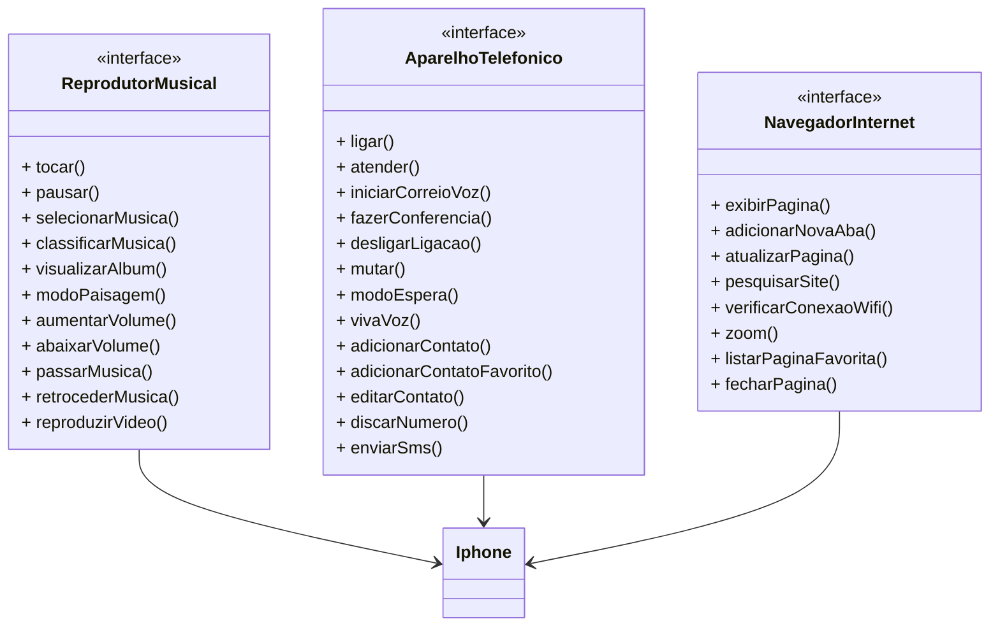

## Diagrama UML - Iphone

```mermaid
classDiagram

class Iphone

class ReprodutorMusical{
	<<interface>>
    + tocar()
    + pausar()  
	+ selecionarMusica()
	+ classificarMusica()
	+ visualizarAlbum()
	+ modoPaisagem()
	+ aumentarVolume()
	+ abaixarVolume()
	+ passarMusica()
	+ retrocederMusica()
	+ reproduzirVideo()
}
class NavegadorInternet{
	<<interface>>
	+ exibirPagina()  
	+ adicionarNovaAba()
	+ atualizarPagina()
	+ pesquisarSite()
	+ verificarConexaoWifi()
	+ zoom()
	+ listarPaginaFavorita()  
	+ fecharPagina()
}

class AparelhoTelefonico{
	<<interface>>
    + ligar()  
	+ atender()
	+ iniciarCorreioVoz()  
	+ fazerConferencia()
	+ desligarLigacao()  
	+ mutar()  
	+ modoEspera()  
	+ vivaVoz()  
	+ adicionarContato()  
	+ adicionarContatoFavorito()
	+ editarContato()  
	+ discarNumero()  
	+ enviarSms()
}

ReprodutorMusical --> Iphone
AparelhoTelefonico --> Iphone
NavegadorInternet --> Iphone

```

***
Diagrama criado para o desafio [Diagramação de Classes do Iphone](https://web.dio.me/project/desafio-de-projeto-1/learning/6d16483b-8e3c-4275-9e1d-9ecea46a839c)
